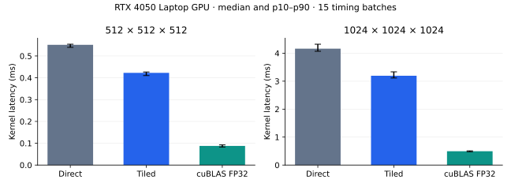

# CUDA GEMM Performance Study

C++/CUDA implementation and measurement of FP32 matrix multiplication: a scalar CPU baseline, a direct GPU kernel, a shared-memory tiled kernel and strict-FP32 cuBLAS. The study follows the complete path from numerical validation to repeated timing, memory/race checks and kernel profiling.

## Measured performance

**RTX 4050 Laptop GPU**, CUDA-event kernel timings; medians from 15 batches per GPU method and shape.

| Shape | Direct CUDA | Shared-memory tiled | cuBLAS FP32 | Tiled speedup over direct |
| --- | ---: | ---: | ---: | ---: |
| 512³ | 0.551 ms | **0.423 ms** | 0.0878 ms | **1.30×** |
| 1024³ | 4.162 ms | **3.193 ms** | 0.495 ms | **1.30×** |

cuBLAS remains **4.82× / 6.45× faster** than the tiled implementation at these sizes. The handwritten kernels make indexing, coalesced access, synchronization and tiling explicit; the library comparison quantifies the remaining optimization gap.



Timings exclude allocation and host↔device transfers. The [full study](docs/PERFORMANCE_STUDY.md) includes rectangles, small shapes, variability, profiler analysis and hardware limits. [Raw timings](results/raw_gemm_2026-10-07.csv), [summary](results/summary_gemm_2026-10-07.csv) and [environment](results/environment_2026-10-07.md) are retained.

## Implementation and validation

For `A[M,K]` and `B[K,N]`, every implementation produces row-major `C[M,N]`. The tiled kernel uses 16×16 shared-memory tiles with masked edge loads. cuBLAS uses `CUBLAS_COMPUTE_32F_PEDANTIC`, avoiding TF32. All four FP32 implementations are checked against a separate FP64 reference.

- **30 deterministic shapes:** random inputs, rectangles and tile-boundary cases; NaN-filled outputs detect unwritten elements.
- **Four Compute Sanitizer tools:** memcheck, racecheck, synccheck and initcheck, with zero reported issues in the retained laptop run.
- **Nsight Compute:** direct/tiled 512³ profiles, native reports and exported counters.
- **Host CI:** CPU numerical checks plus raw/summary consistency, invalid-timing rejection and CSV contract checks. GPU correctness and profiling are run on NVIDIA hardware.

## Build and verify

Prerequisites: an NVIDIA GPU and driver, CUDA Toolkit, CMake 3.24 or newer, and a CUDA-supported C++ compiler. On Windows, the tested configuration uses Microsoft C++ Build Tools 2026 and the x64 release build. If the toolkit was installed without adding paths to the shell, set them before configuring and running:

```powershell
$env:CUDA_PATH = 'C:\Program Files\NVIDIA GPU Computing Toolkit\CUDA\v13.2'
$env:CUDA_PATH_V13_2 = $env:CUDA_PATH
$env:PATH = "$env:CUDA_PATH\bin\x64;$env:PATH"
cmake -S . -B build -A x64 -DCMAKE_CUDA_ARCHITECTURES=89
cmake --build build --config Release
ctest --test-dir build -C Release --output-on-failure
```

The correctness executable tests the CPU, direct CUDA, tiled CUDA, and cuBLAS implementations on 30 deterministic cases. These include random inputs, rectangular shapes, and dimensions below, exactly on, and above the 16-element tile boundary. Each result is compared against an FP64 reference with a fixed absolute and relative tolerance. Output buffers are filled with NaNs before GPU calls to detect unwritten elements.

The verified release build passed all 30 cases. Compute Sanitizer memcheck, racecheck, synccheck, and initcheck reported zero errors. Nsight Compute profiles were collected for both handwritten kernels at 512³. The [performance study](docs/PERFORMANCE_STUDY.md) records the exact commands, measurements, hardware, and limits.

## Benchmark

Run the correctness test before timing. The benchmark uses nonzero seeded inputs and records every repetition in CSV:

```powershell
New-Item -ItemType Directory -Force results | Out-Null
.\build\Release\gemm_benchmark.exe --output results\raw_gemm.csv
python scripts\summarize.py results\raw_gemm.csv results\summary_gemm.csv
```

GPU time is measured with CUDA events on the default stream, after 10 warmups, across 15 independent batches per method and shape. Each batch contains multiple calls; the raw CSV reports batch time and per-call time. CPU time uses `steady_clock`, one warmup and seven repetitions, and is reported separately. GPU timings exclude allocation and host↔device transfers; CPU timing covers only multiplication. The benchmark includes `128³`, `512³`, `1024³`, and a rectangular `255×257×129` case. The CPU baseline is timed on the two smaller cases. The summary script reports median, 10th and 90th percentile per-call latency plus throughput calculated as `2MNK / time`.

## Checks without a GPU

```bash
python -m unittest discover -s tests -p 'test_*.py' -v
g++ -std=c++17 -O2 -Wall -Wextra -Werror -Iinclude cpp/cpu_baselines.cpp tests/cpu_correctness.cpp -o /tmp/cpu_correctness
/tmp/cpu_correctness
```

The summary tool validates positive finite timings, batch/per-call consistency and unique repetitions before aggregation. To regenerate the figure, install Matplotlib and run `python scripts/plot_results.py`. These checks validate retained artifacts and the CPU baseline; they do not rerun GPU kernels.
